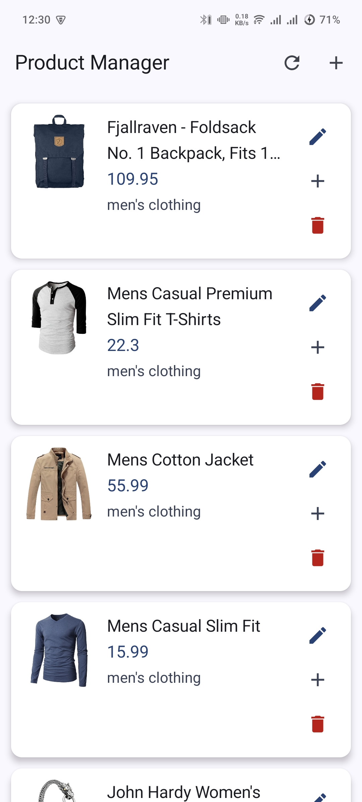
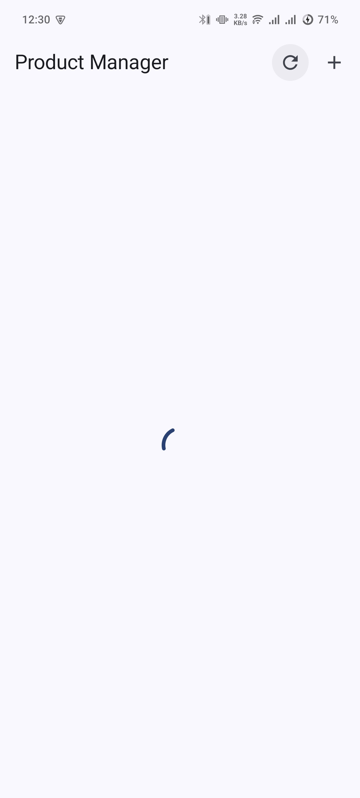
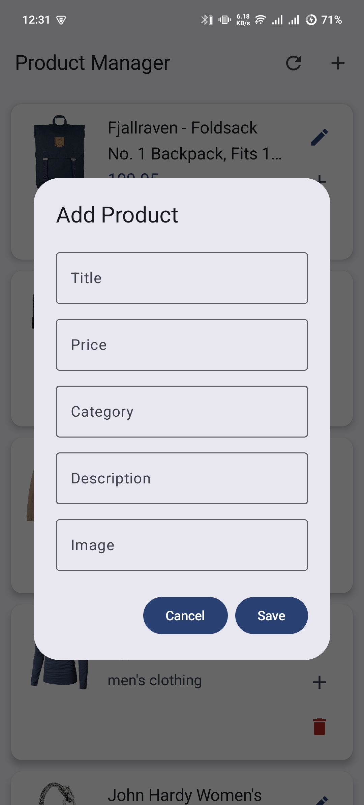

# Retrofit AppDhaRa

A modern Android application demonstrating CRUD operations using Retrofit, Jetpack Compose, and Clean Architecture. This app interacts with the [Fake Store API](https://fakestoreapi.com/) to manage a list of products.

## 🚀 Features

*   **View Products**: Fetch and display a list of products from the API (GET).
*   **Product Details**: View detailed information about a specific product.
*   **Create Product**: Add new products to the catalog (POST).
*   **Update Product**: Modify existing product information (PUT).
*   **Patch Product**: Partially update product details (PATCH).
*   **Delete Product**: Remove products from the list (DELETE).
*   **Loading & Error States**: Graceful handling of network requests with UI feedback.

## 🛠 Tech Stack

*   **Language**: [Kotlin](https://kotlinlang.org/)
*   **UI Framework**: [Jetpack Compose](https://developer.android.com/jetpack/compose)
*   **Architecture**: MVVM (Model-View-ViewModel) + Clean Architecture
*   **Dependency Injection**: [Hilt](https://developer.android.com/training/dependency-injection/hilt-android)
*   **Networking**: [Retrofit](https://square.github.io/retrofit/) & [Gson](https://github.com/google/gson)
*   **Image Loading**: [Coil](https://coil-kt.github.io/coil/)
*   **Asynchronous Programming**: Coroutines & Flow

## 🏗 Architecture

The project is structured following **Clean Architecture** principles, divided into three main layers:

### 1. Data Layer
*   **Remote API**: Retrofit interface defining the API endpoints.
*   **Implementation**: Handles data fetching and mapping.

### 2. Domain Layer
*   **Models**: Plain Kotlin data classes (e.g., `Product`).
*   **Repository Interface/Implementation**: Abstracting data sources from the UI.

### 3. Presentation Layer
*   **ViewModels**: Managing UI state and handling user interactions using `StateFlow`.
*   **Screens (Compose)**: Declarative UI components that react to state changes.
*   **UI State**: Sealed classes to represent Loading, Success, and Error states.

## 📸 Screenshots

| Product List | Product Detail | Add Product |
| :---: | :---: | :---: |
|  |  |  |

## 🚦 Getting Started

### Prerequisites
*   Android Studio Ladybug or newer.
*   JDK 17+.

### Installation
1.  Clone the repository:
    ```bash
    git clone https://github.com/imrankhalid001/JetPackComposeTask.git
    ```
2.  Open the project in Android Studio.
3.  Sync Gradle and run the app on an emulator or physical device.

---
Developed by [Your Name/Handle]
